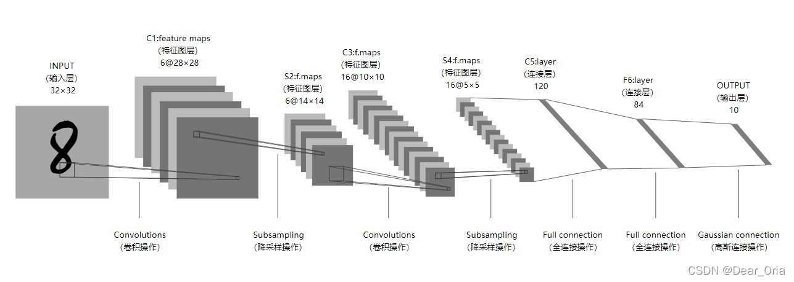
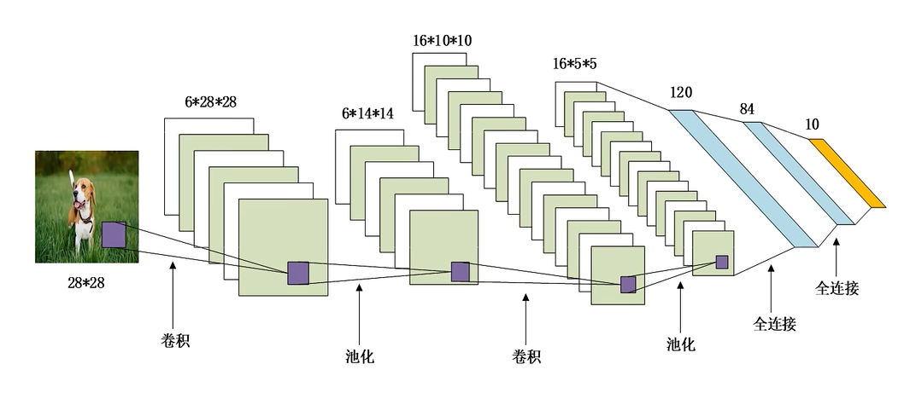

# 这个项目是对古早时期的神经网络：LeNet5来学习
MNIST 中使用的 LeNet5 结构图 

本次 FashionMNIST 中使用的 LeNet5 结构图 

Yann Lecun 于 1998 年提出并用于手写体字符的识别，是最为经典的 CNN 之一。
可以说是 CNN 的 "Hello World!"项目。

本次使用它来进行 FashionMNIST 的分类任务，在200 epoch 后达到 87.3% 的正确率

网络共有 7 层:

* 0.输入层，本次输入层大小为 1x28x28, 因此无法直接使用MNIST的 1x32x32 网络的结构
* 1.卷积层1，卷积核 5x5x6, 填充 2
* 2.池化层2，AvgPool 池化区域 2x2, 步长 2
* 3.卷积层3，卷积核 5x5x16, 填充 0
* 4.池化层4，AvgPool 池化区域 2x2, 步长 2
* 5.本次使用了Flatten层和全连接层，也可使用卷积核 5x5x120 得到 120 个特征图
* 6.全连接层，in_features = 120，out_features = 84
* 7.全连接层，in_features = 84，out_features = 10

## 下面是这个小型神经网络的一些参数

----------------------------------------------------------------
        Layer (type)               Output Shape         Param #
----------------------------------------------------------------
            Conv2d-1            [-1, 6, 28, 28]             156
           Sigmoid-2            [-1, 6, 28, 28]               0
         AvgPool2d-3            [-1, 6, 14, 14]               0
            Conv2d-4           [-1, 16, 10, 10]           2,416
           Sigmoid-5           [-1, 16, 10, 10]               0
         AvgPool2d-6             [-1, 16, 5, 5]               0
           Flatten-7                  [-1, 400]               0
            Linear-8                  [-1, 120]          48,120
            Linear-9                   [-1, 84]          10,164
           Linear-10                   [-1, 10]             850
----------------------------------------------------------------
        Total params                        61,706
        Trainable params                    61,706
        Non-trainable params                0
----------------------------------------------------------------
        Input size (MB)                     0.00
        Forward/backward pass size (MB)     0.11
        Params size (MB)                    0.24
        Estimated Total Size (MB)           0.35
----------------------------------------------------------------
